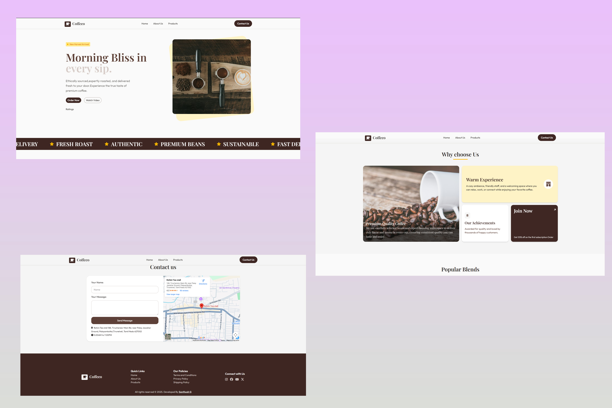

# ☕ Coffee Shop Landing Page

A modern, responsive, and visually appealing landing page for a coffee shop. This project was built to showcase a clean UI/UX design and smooth navigation for coffee lovers.

## 🚀 Live Demo

You can view the live version of the website here:
👉 **[Click Here](https://santhosh-006.github.io/coffee-shop-page-cyberdude/)**

## 📸 Website Preview

**Check out the look and feel of the project**:

## 

## ✨ Features

- **Responsive Design:** Fully optimized for Mobile, Tablet, and Desktop.
- **Hero Section:** Eye-catching introduction with a call-to-action.
- **Menu Gallery:** Beautiful display of coffee varieties and treats.
- **Smooth Animations:** Hover effects and transitions for a premium feel.
- **About & Contact:** Information about the shop and how to reach out.

## 🛠️ Tech Stack

- **HTML5:** Semantic structure.
- **TailwindCss:** Custom styling and Flexbox/Grid layouts.

**Developed By [Santhosh G](https://github.com/Santhosh-006)**
